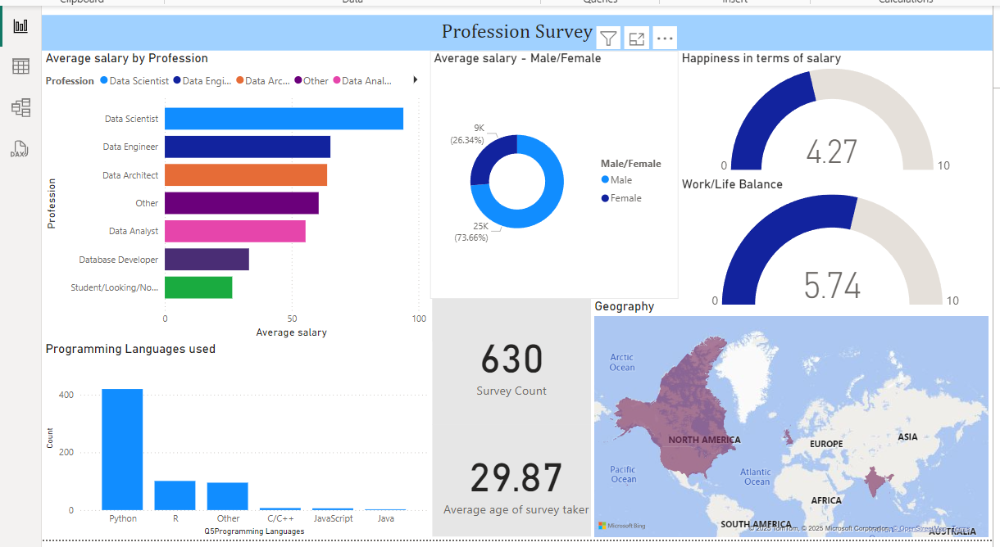

# Data Professional Survey Dashboard

## Project Overview

This project visualizes insights from a survey conducted among data professionals, using Power BI to create an interactive dashboard. The dashboard provides an overview of key metrics, such as average salaries by profession, programming languages used, happiness scores, work-life balance, and geographical trends.

The primary goal of this project is to understand the landscape of data professionals, including their demographics, tools, and satisfaction levels.

---

## Dashboard Preview

  
*Above: Interactive dashboard showcasing insights from the survey.*

---

## Dashboard Highlights

### Key Features:

1. **Average Salary by Profession**  
   A bar chart displaying average salaries across different roles such as:
   - Data Scientist
   - Data Engineer
   - Data Architect
   - Data Analyst
   - Database Developer  

2. **Programming Languages Used**  
   A bar chart showing the popularity of programming languages among survey respondents, highlighting:
   - Python (most used)
   - R
   - C/C++
   - JavaScript, and more.

3. **Demographics and Survey Insights**
   - **Gender Distribution**: Visualized in a pie chart to indicate the percentage of male and female participants.
   - **Geography**: A map showing the distribution of respondents globally.
   - **Happiness and Work-Life Balance Scores**: Gauges displaying average scores for job satisfaction and work-life balance.

4. **Survey Summary**:
   - Total responses: 630
   - Average age of respondents: ~30 years

---

## Dataset Details

The dataset contains responses from a survey conducted among data professionals. Key columns include:
- **Profession**: The role of the respondent (e.g., Data Scientist, Data Engineer).
- **Salary**: Annual salary in thousands.
- **Programming Languages**: Languages used professionally.
- **Demographics**: Gender, country, and age.
- **Happiness Metrics**: Scores for job satisfaction, management, and work-life balance.

---

## Tools Used

- **Power BI**: For data visualization and interactive dashboard creation.
- **Excel**: For dataset cleaning and preprocessing.

---

## Data Cleaning and Transformation

The dataset was cleaned and transformed using **Power Query Editor** in Power BI. Key steps include:

1. **Data Cleaning**:
   - Removed irrelevant or duplicate rows.
   - Handled missing values to ensure consistency in analysis.

2. **Data Transformation**:
   - Added calculated columns for metrics such as age groups and salary ranges.
   - Splitted columns to remove unwanted data.

3. **Data Enrichment**:
   - Created custom columns to derive insights, such as average happiness scores and work-life balance ratings.
   - Generated summary statistics to identify trends in programming language usage and demographic distributions.

These steps ensured the dataset was accurate, consistent, and optimized for visualization.

---

## Insights and Observations

- **Highest Salary**: Data Scientists reported the highest average salary compared to other roles.
- **Programming Preference**: Python emerged as the most popular language among professionals.
- **Work-Life Balance**: Despite relatively high satisfaction levels, work-life balance scores suggest room for improvement.

---

## Files in the Repository

- `survey_data.xlsx`: Raw dataset used for visualization.
- `Power_BI_report.pbix`: Power BI file containing the interactive dashboard.
- `README.md`: Documentation of the project.
- `Dashboard.png`: Image of the dashboard.

---

